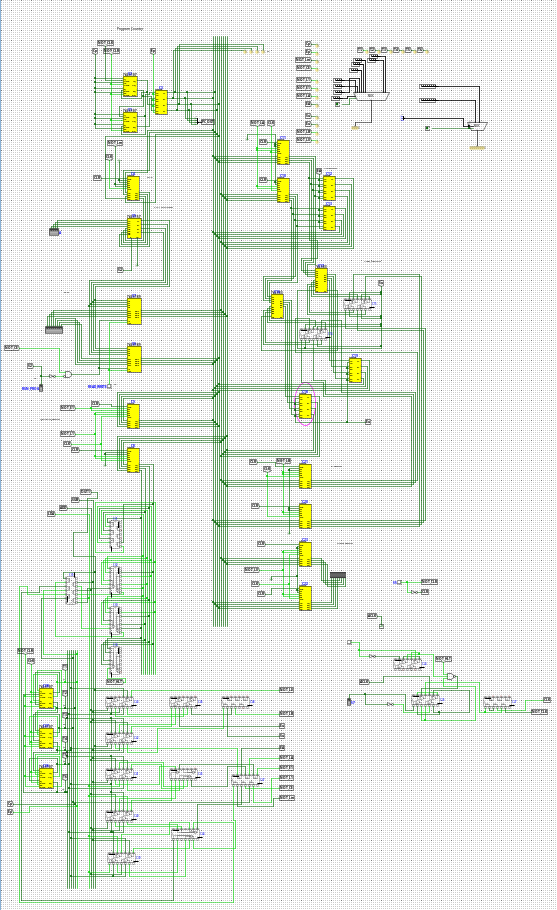

# Simple As Possible computer in Logisim-Evolution

This is a digital computer using SAP-1 design from the book [\[1\]](#ref1), implemented in Logisim-Evolution [\[2\]](#ref2).

External library [\[3\]](#ref3) is used for implementation of 74xx series chips, circuits updated for Logisim-Evolution.

This implementation follows design from the book and for this purpose exact chips were used as in the book. It can be used as a reference to follow the book.

## Refereces:

1. 
Albert P. Malvino and Jerald A. Brown, *Digital Computer Electronics*, 3rd ed., Glencoe, 1999. ISBN: 0028005945.

2. 
Burch, C., Kluter, T., Maehne, T., Walsh, K., Hutchens, D. H., Orlowski, M., Niget, T., Berman, M., & Cruz Franqueira, T. (2024). Logisim-evolution (Version 3.9.0) [Computer software]. https://github.com/logisim-evolution/logisim-evolution

3. logi7400 — Logisim 7400 series integrated circuits library: <https://github.com/r0the/logi7400>
